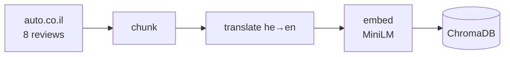
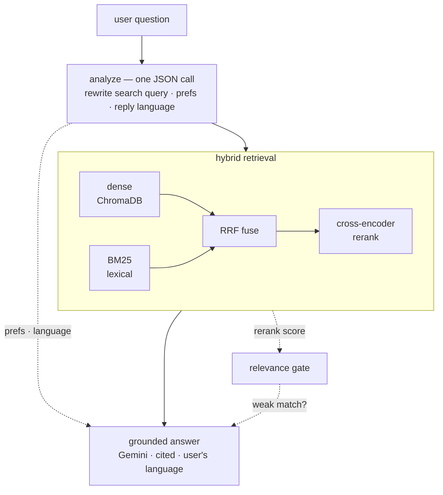
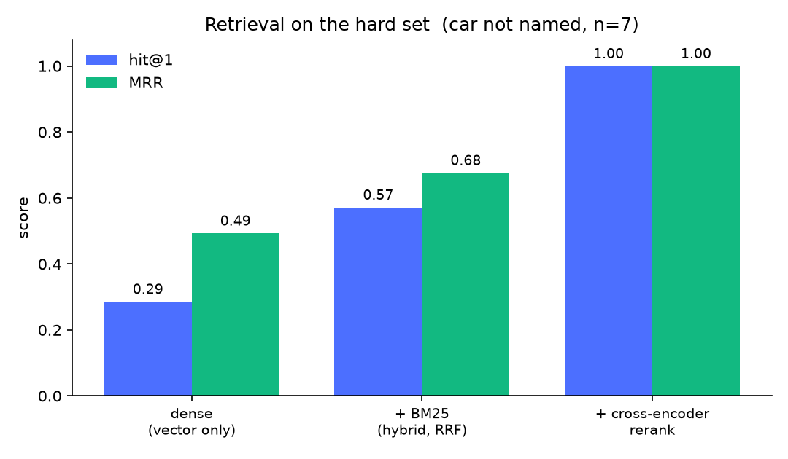

# AutoSage — a grounded car-advice chatbot

A proof-of-concept AI chatbot that helps people understand and compare cars using
real automotive road-test content. It ingests eight professional reviews from
[auto.co.il](https://www.auto.co.il), builds a searchable knowledge base, and
holds a natural conversation whose answers are **grounded in the retrieved
reviews** (not hallucinated) — while gradually inferring what the user is looking
for.

### Demo

<video src="https://github.com/OfirOhan/bleader-ai-chatbot/raw/master/demo/demo.mp4" controls muted width="720"></video>

A short walkthrough: a grounded comparison with citations, a context-aware
follow-up, an out-of-scope refusal, preference inference, and a reply in Hebrew.
*(If the player doesn't load, [download the clip](demo/demo.mp4).)*

---

## What it does

- **Ingests & understands** the 8 road-test articles (Hebrew, real-world unstructured text).
- **Retrieves** the most relevant passages per question with **hybrid search** — dense vectors **+** BM25, fused and **cross-encoder-reranked** — over a local **ChromaDB**.
- **Answers** conversationally, grounded strictly in the retrieved passages, with **source citations** back to the original articles.
- **Knows what it doesn't know** — a relevance gate + a strict prompt make it decline questions about cars it has no review for, instead of inventing.
- **Infers preferences** as you chat (budget, body type, powertrain, priorities, shortlist) and feeds them back into its answers so advice gets more personal over time.
- **Replies in your language** — ask in Hebrew or English.
- Wraps it all in a polished **web chat UI** (React) with light/dark themes.

---

## Architecture

**Ingest** (one-off — builds the knowledge base):



**Chat turn** (per question):



Stack: **React** UI → **FastAPI** → `rag.py` (ChromaDB · MiniLM · BM25 · cross-encoder · Gemini), with **SQLite** for users, conversations, and per-conversation preferences.

### Components

| Layer | Choice | Why |
|-------|--------|-----|
| Vector DB | **ChromaDB** (local, persistent) | Assignment requirement; zero-setup, runs in-process. |
| Embeddings | **`all-MiniLM-L6-v2`** | Assignment option B — local, free, no API key. |
| Lexical search | **BM25** (`rank-bm25`) over the English chunks | Recovers exact tokens dense retrieval blurs — model names, trims, spec numbers. |
| Fusion | **Reciprocal Rank Fusion** | Combines the dense and lexical rankings so each covers the other's blind spot. |
| Reranker | **cross-encoder `ms-marco-MiniLM-L-6-v2`** | Scores each (query, passage) pair for true relevance; also powers the relevance gate. |
| LLM | **Gemini** (`google-genai`, `gemini-3.1-flash-lite`) | Answer generation, he↔en translation, preference + language extraction. |
| Extraction | **trafilatura** (+ BeautifulSoup fallback) | Robustly isolates article body from nav/ads/comments. |
| API | **FastAPI** + **SQLite** | Small, synchronous, dependency-light. |
| UI | **React + Vite** | Reused/rebranded from an existing chat app of mine. |

### Key design decision — the Hebrew ↔ MiniLM trade-off

The articles are in **Hebrew**, but `all-MiniLM-L6-v2` is trained on **English**
and retrieves Hebrew poorly. Rather than switch models (the two allowed options
were MiniLM or Azure `text-embedding-3-small`), I keep MiniLM and **translate to
English at ingest time**: each chunk is translated once (cached to disk), the
**English** text is embedded, and the **original Hebrew** is stored as the
document and used for grounding — so the answer never round-trips through a lossy
translation. User questions are translated the same way before retrieval, so the
query lands in the same monolingual English vector space. This keeps retrieval
quality high while honoring the model constraint.

### Retrieval — why hybrid + rerank

Pure vector search was the obvious start, but it has two weaknesses on this
corpus, both measured (see **Evaluation**):

1. **It misses exact matches.** A question often hinges on a literal string — a
   model name ("RS3", "GV80"), a spec number ("670-liter trunk"), an engine term
   ("five-cylinder"). Because the vectors are built from a translation, those
   tokens don't reliably land near the query in vector space, so the right review
   can rank low. **BM25** matches them literally and catches what dense search
   misses; the dense and lexical rankings are then merged with **Reciprocal Rank
   Fusion**.
2. **The best passages still need reordering.** Hybrid search gets the right
   review *into* the shortlist, but not always at the top. A **cross-encoder**
   re-scores each (query, passage) pair by reading them together — more precise
   than comparing two independent vectors — and reorders the shortlist. On the
   hard questions (car not named), this lifts top-1 accuracy from **0.29 → 1.00**.

### Grounding & anti-hallucination

Two layers, deliberately kept independent:

- **The prompt (primary).** Principle-based, not a hardcoded car list: the model
  is told its knowledge is *only* the supplied passages; if it has no review for
  a car it must say so rather than answer from general knowledge; it may relay
  what a passage says about a car it *mentions*, attributed. This generalizes and
  won't rot as the corpus changes.
- **The relevance gate (secondary).** A cheap out-of-scope detector: is there
  actually a relevant review for this question? Cosine similarity answers badly —
  ask about a Tesla and it happily returns the Aion HT review (which *mentions* the
  Tesla Model Y as a rival) with a high score, even though we have no Tesla review.
  The cross-encoder, which reads question and passage together, isn't fooled: it
  scores that passage low. So we take its top score as the signal — below a
  threshold, the answer prompt is told "the match is weak, decline if it doesn't
  fit." It only *nudges*; the prompt is the real guard.

Every answer returns the set of source cars/URLs it drew from, rendered as
clickable citation chips.

### Turn analysis — preferences, language, and query rewrite in one call

Before retrieval, a single JSON-mode Gemini call does three jobs at once:

1. **Updates the preference profile** (`budget`, `body_type`, `powertrain`,
   `usage`, `priorities`, `candidates`), persisted on the conversation and fed
   back into the answer prompt so advice personalizes over time.
2. **Rewrites the question into a standalone search query**, resolving pronouns
   from the conversation — so a follow-up like *"which is cheaper?"* becomes
   *"Genesis GV80 vs Kia EV9 price"* and retrieves the right passages instead of
   generic ones.
3. **Picks the reply language** (honoring explicit requests like "answer in
   Hebrew" even when typed in English).

All three are extraction over the same message + context, so merging them keeps a
chat turn to **two Gemini calls** (analyze + answer).

---

## Evaluation

Two harnesses, both runnable. Retrieval quality needs no LLM judge — it's scored
against hand-labeled ground truth (which car each question is about).

**Retrieval** (`uv run python -m eval.retrieval_eval`, local & free) — the run also
writes the metrics and this chart to [`eval/results/`](eval/results):



| Retriever | hit@1 (hard set) | MRR (hard set) |
|-----------|:---:|:---:|
| dense (vector only) | 0.29 | 0.49 |
| + BM25 (hybrid, RRF) | 0.57 | 0.68 |
| + cross-encoder rerank | **1.00** | **1.00** |

The "hard set" = questions that describe a car by a feature/spec **without
naming it** — the case where retrieval quality actually matters. (When the car is
named, all three score 1.00; that's a sanity floor, not a discriminator.) Each
stage does exactly its job. The gate also cleanly separates in-scope questions
(rerank score ≈ +6) from out-of-scope ones (≈ −6 to −11).

**Faithfulness** (`uv run python -m eval.faithfulness_eval`, judged by a **local
Qwen** via Ollama — independent of the generator, zero API cost):

- In-scope groundedness **4.13 / 5**, hallucination **0%** (nothing fabricated
  across the in-scope answers), out-of-scope correctly declined **4/4**. The
  points below 5 are answers that *declined* a paraphrased fact they had actually
  retrieved (the passage-level-recall limitation noted below) — precision over
  recall, not invention.

Unit + retrieval-behavior tests: `uv run pytest` (6 tests, no API needed).

---

## Project layout

```
autosage/
├── backend/
│   ├── config.py       # env + paths + retrieval knobs
│   ├── corpus.py       # the 8 articles; fetch / extract / chunk
│   ├── translate.py    # he→en with a persistent cache
│   ├── embeddings.py   # MiniLM wrapper
│   ├── store.py        # ChromaDB access (dense search + all-chunks)
│   ├── lexical.py      # BM25 index over the English chunks
│   ├── rerank.py       # cross-encoder reranker
│   ├── ingest.py       # build the knowledge base  (python -m backend.ingest)
│   ├── llm.py          # Gemini client (text + JSON + translation)
│   ├── rag.py          # hybrid retrieve → RRF → rerank → gate → grounded answer
│   ├── db.py           # SQLite (users, conversations + preferences, messages)
│   ├── schemas.py      # Pydantic request/response models
│   └── app.py          # FastAPI endpoints
├── frontend/           # React + Vite chat UI
├── eval/               # labeled set + retrieval eval + faithfulness (local judge)
├── tests/              # pytest: pure functions + retrieval behavior
├── docker/             # backend + frontend Dockerfiles, nginx config
├── docker-compose.yml  # full stack: frontend (nginx) + backend
├── .github/workflows/  # CI: pytest + frontend build + docker build
├── docs/EXAMPLE.md     # a sample interaction
├── pyproject.toml      # deps + project metadata (uv)
├── uv.lock             # pinned, reproducible dependency versions
└── .env.example
```

---

## Quickstart

### Option A — Docker (one command)

**Prereqs:** Docker + a Gemini API key.

```bash
echo "GEMINI_API_KEY=your-key" >> .env
docker compose up --build
```

Open **http://localhost:5173**, sign in with any email, and start asking about cars.

On the **first** boot the backend builds the knowledge base automatically (fetches
+ ingests the 8 articles — a minute or two), then serves. ChromaDB, chat history,
and model weights persist in named volumes, so every boot after that skips ingest
and starts instantly. Tear down with `docker compose down` (add `-v` to also wipe
the KB).

### Option B — Local (uv + Node)

**Prereqs:** [uv](https://docs.astral.sh/uv/), Node 18+, and a Gemini API key
([aistudio.google.com/apikey](https://aistudio.google.com/apikey)).
uv installs Python 3.10+ for you if you don't have it.

```bash
# 1. Backend deps + key
uv sync                         # creates .venv and installs from the lockfile
cp .env.example .env            # then paste your GEMINI_API_KEY into .env

# 2. Build the knowledge base (fetches the 8 articles, ~1–2 min the first time)
uv run python -m backend.ingest

# 3. Run the API (http://127.0.0.1:8000)
uv run uvicorn backend.app:app --reload

# 4. Run the UI (separate terminal → http://localhost:5173)
cd frontend
npm install
npm run dev
```

> `uv run <cmd>` runs a command inside the project environment (no manual
> `activate` needed). Prefer it over `pip`/`python` directly.

Open http://localhost:5173, sign in with any email, and start asking about cars.

> `python -m backend.ingest` is required once before chatting — it populates
> ChromaDB. Re-run with `--refresh` to re-download the articles.

**Tests & eval:**
```bash
uv run pytest                                     # unit + retrieval tests
uv run python -m eval.retrieval_eval              # retrieval hit@k / MRR + gate
# faithfulness eval needs a local OpenAI-compatible judge, e.g. Ollama:
#   JUDGE_BASE_URL=http://localhost:11434/v1 JUDGE_MODEL=qwen2.5:7b \
#   uv run python -m eval.faithfulness_eval
```

**CI** ([`.github/workflows/ci.yml`](.github/workflows/ci.yml)): every push/PR runs the
pytest suite (the retrieval tests auto-skip without a KB, so no API key is needed),
a production frontend build, and a build of both Docker images.

---

## Notes, scope & trade-offs

- **Scope:** this is a POC, not production. Auth is "email = credential" (no
  password) so the demo has per-user history without friction. Ingest and chat
  are synchronous.
- **Cost/perf:** translation is cached, so ingest only pays for it once. A chat
  turn is two Gemini calls (analyze + answer) plus local embed / BM25 / rerank.
- **What you can ask about:** the knowledge base covers these 8 cars, so questions
  should stay within them (anything else is correctly declined) — Citroën C3 (2026),
  Audi RS3 (facelift), Kia EV9 (long-term), MG S6, Hyundai Elantra N (manual),
  Aion HT, Lynk & Co 01 (2026), Genesis GV80 (2026).

### Considered and deliberately scoped out

- **Query expansion / a summary-index router** — recall isn't the bottleneck with
  top-k over a tiny corpus, and there's only one collection to route to.
- **A larger eval set / a stronger judge** — the labeled set is small (≈19 Qs) and
  the local 7B judge is imperfect (it gave the odd inconsistent verdict, which I
  cross-checked by hand). Enough to *measure and compare*; not a benchmark.
- **RAGAS (or a similar eval framework)** — it would standardize the faithfulness
  metrics and runs fine on the same local Qwen. For a corpus this size I preferred
  a small, transparent harness: the retrieval metrics are scored against labels and
  need no judge at all, and the faithfulness judge is a few readable lines rather
  than framework indirection. RAGAS is the natural step up once the eval set grows.

### Known limitations

- **Passage-level recall isn't gated.** Retrieval is evaluated at the car level;
  the strict grounding prompt can occasionally decline a paraphrased fact it
  actually retrieved (e.g. "27-inch curved display" vs the stored "27-inch screen
  strip") — a conscious precision-over-recall choice.
- **The gate threshold** is a documented precision/recall knob, left untuned
  rather than overfit to a 19-question set.

### What I'd add next

- **Streaming responses** so answers appear token-by-token instead of after a pause.
- **Per-citation quoting** — surface the exact sentence each claim came from, not
  just the source car.
- **Passage-level retrieval metrics**, to measure recall on the specific fact a
  question asks about (today's eval is at the car level — see limitations above).
- **A larger labeled set and a stronger judge**, to turn the eval from a
  comparison tool into a real benchmark.

See the **[demo video](demo/demo.mp4)**, or **[docs/EXAMPLE.md](docs/EXAMPLE.md)**
for the same walkthrough as a written transcript.
